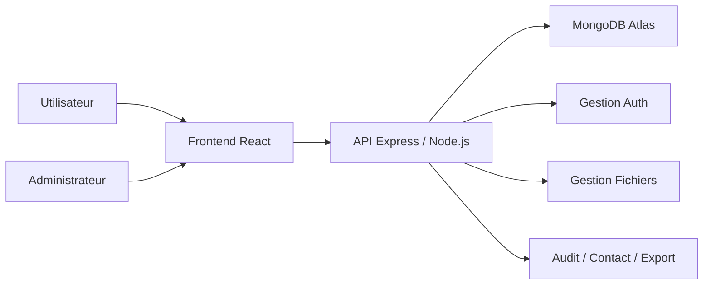

# Rapport De Stage / Projet De Fin D'Etudes

## Conception Et Realisation D'une Application Web De Gestion Des Fichiers, Des Acces Et Des Tableaux De Bord Analytiques

### Projet : TMMS - Task & Machine Management System / Analytics Workbench

---

## Page De Garde

- **Etablissement** : A completer
- **Filiere** : A completer
- **Option** : A completer
- **Titre** : Conception et realisation d'une application web de gestion des fichiers, des acces et des tableaux de bord analytiques
- **Nom et prenom** : A completer
- **Encadrant pedagogique** : A completer
- **Encadrant professionnel** : A completer
- **Organisme d'accueil** : A completer
- **Periode de stage** : A completer
- **Annee universitaire** : 2025 - 2026

---

# Table Des Matieres

- Introduction
- 1 Etude Prealable
  - 1.1 Introduction
  - 1.2 Besoins fonctionnels
  - 1.3 Besoins non fonctionnels
  - 1.4 Conclusion
- 2 Etude Conceptuelle
  - 2.1 Introduction
  - 2.2 Description et choix des outils techniques
  - 2.2.1 Choix des outils de developpement
  - 2.3 Architecture du systeme
  - 2.3.1 Specifications ou conception generale
  - 2.3.2 Les modeles de cycle de vie
  - 2.4 Choix du langage de conception
  - 2.4.1 Choix d'UML
  - 2.4.2 Notions UML
  - 2.4.3 Pourquoi une methode objet ?
  - 2.5 Conception de l'application
  - 2.5.1 Diagramme de cas d'utilisation
  - 2.5.2 Diagramme de classe
  - 2.6 Conclusion
- 3 Realisation
  - 3.1 Introduction
  - 3.2 Environnements de travail et choix techniques
  - 3.2.1 Environnements de travail
  - 3.2.2 Langages de programmation et technologies utilises
  - 3.2.3 Plan de realisation du projet
  - 3.3 Conclusion
- 4 Presentation de l'application
  - 4.1 Introduction
  - 4.2 Interface d'accueil
  - 4.3 Interface d'authentification
  - 4.4 Tableau de bord
  - 4.5 Centre de gestion des fichiers
  - 4.6 Gestion des utilisateurs
  - 4.7 Interface utilisateur et profil
  - 4.8 Les roles
  - 4.9 Les permissions
  - 4.10 Notifications
  - 4.11 Rapports, exports et journaux d'audit
- Conclusion generale
- Webographie

---

# Introduction

La digitalisation des processus internes est devenue une necessite pour les organisations qui souhaitent ameliorer la gestion de l'information, la securite des acces et la disponibilite des donnees. Dans ce cadre, la mise en place d'une application web centralisee permet de reduire les traitements manuels, d'encadrer les droits des utilisateurs et d'optimiser la circulation des documents et des informations analytiques.

Le present projet porte sur la conception et la realisation d'une application web intitulee **TMMS**, pour **Task & Machine Management System / Analytics Workbench**. Cette plateforme a pour vocation de centraliser la gestion des fichiers, le controle d'acces, la gestion des utilisateurs ainsi que l'exploitation analytique de certaines donnees importees depuis des fichiers Excel ou des liens de tableaux de bord.

L'objectif principal de ce travail est de proposer une solution moderne, responsive, securisee et accessible en ligne. Pour atteindre cet objectif, le projet a ete realise a l'aide de technologies web actuelles telles que **React**, **Node.js**, **Express** et **MongoDB Atlas**.

Ce rapport presente de maniere structuree l'etude prealable, l'etude conceptuelle, la phase de realisation ainsi que la presentation detaillee des principales interfaces de l'application.

---

# 1 Etude Prealable

## 1.1 Introduction

Avant de commencer le developpement de l'application, il a ete necessaire d'etudier les besoins reels auxquels la solution devait repondre. Cette phase d'etude prealable a permis d'identifier les attentes des futurs utilisateurs, les contraintes techniques ainsi que les objectifs fonctionnels et non fonctionnels du systeme.

Le constat de depart montre que la gestion des fichiers et des acces est souvent dispersee dans plusieurs outils, sans centralisation suffisante ni tracabilite fiable. De plus, les utilisateurs ont besoin d'un acces simple a leurs ressources, tandis que l'administrateur doit pouvoir superviser l'ensemble des operations.

## 1.2 Besoins fonctionnels

L'application doit permettre les fonctionnalites suivantes :

- inscription et connexion des utilisateurs ;
- gestion de session avec authentification securisee ;
- gestion des profils utilisateurs ;
- ajout et suppression des utilisateurs par l'administrateur ;
- importation de fichiers et de donnees Excel ;
- ajout de liens vers des tableaux de bord analytiques ;
- assignation des fichiers a un ou plusieurs utilisateurs ;
- consultation uniquement des fichiers autorises ;
- demande d'acces a un fichier restreint ;
- approbation ou rejet des demandes par l'administrateur ;
- reception de messages depuis une page contact ;
- consultation de notifications cote administrateur ;
- tenue d'un journal d'audit des actions importantes ;
- export des journaux d'audit en Excel et PDF ;
- nettoyage partiel de certaines donnees de la base ;
- ajout et suppression de photo de profil.

## 1.3 Besoins non fonctionnels

En plus des besoins fonctionnels, le systeme doit respecter plusieurs exigences de qualite :

- etre simple et intuitif a utiliser ;
- presenter une interface moderne et responsive ;
- fonctionner sur differents supports ;
- assurer un niveau de securite correct ;
- etre evolutif pour accueillir de nouvelles fonctionnalites ;
- etre maintenable ;
- garantir une bonne organisation du code ;
- etre deployable sur une infrastructure cloud gratuite.

## 1.4 Conclusion

L'etude prealable a permis de clarifier le besoin global du projet et de definir une orientation claire pour la suite du travail. Les besoins identifies montrent la necessite d'une application modulaire, securisee et facile d'utilisation, capable de combiner gestion documentaire, controle d'acces et visualisation analytique.

---

# 2 Etude Conceptuelle

## 2.1 Introduction

L'etude conceptuelle constitue une etape essentielle dans la reussite du projet. Elle permet de structurer la solution, de choisir les outils appropries, de definir l'architecture du systeme et de preparer la conception des differents modules fonctionnels.

Dans cette partie, nous presentons les choix techniques retenus, l'architecture generale du systeme, ainsi que les principes de conception qui ont guide le developpement de l'application.

## 2.2 Description et choix des outils techniques

Le choix des technologies a ete base sur plusieurs criteres :

- simplicite de mise en oeuvre ;
- disponibilite d'une documentation riche ;
- compatibilite avec une architecture web moderne ;
- possibilite de deploiement gratuit ;
- capacite a produire une interface performante et maintenable.

## 2.2.1 Choix des outils de developpement

Les principaux outils et technologies utilises dans ce projet sont :

- **Visual Studio Code** comme environnement de developpement ;
- **Git** et **GitHub** pour le versionnement ;
- **React** pour le frontend ;
- **Vite** comme outil de build et de lancement rapide ;
- **Node.js** et **Express** pour le backend ;
- **MongoDB Atlas** pour la base de donnees ;
- **Axios** pour les requetes HTTP ;
- **JWT** pour la gestion de l'authentification ;
- **bcryptjs** pour le hachage des mots de passe ;
- **Mongoose** pour la manipulation des modeles de donnees ;
- **multer** pour la gestion des fichiers ;
- **xlsx** et **pdfkit** pour les exports et traitements documentaires.

## 2.3 Architecture du systeme

L'application repose sur une architecture separee en deux couches principales :

- une couche **frontend** responsable de l'affichage et des interactions utilisateur ;
- une couche **backend** chargee de la logique metier, de l'authentification et de l'acces aux donnees.

La base de donnees centralise les informations relatives aux utilisateurs, aux fichiers, aux demandes d'acces, aux messages de contact et aux journaux d'audit.

## 2.3.1 Specifications ou conception generale

La conception generale repose sur plusieurs modules independants mais relies :

- module d'authentification ;
- module de gestion des utilisateurs ;
- module de gestion des fichiers ;
- module de demandes d'acces ;
- module de contact ;
- module d'audit ;
- module de profil utilisateur.

Cette decomposition modulaire facilite l'evolution du systeme et limite les dependances directes entre les composants.

## 2.3.2 Les modeles de cycle de vie

Pour ce projet, une demarche iterative a ete adoptee.  
Le systeme a ete enrichi progressivement par lots fonctionnels :

- mise en place de l'authentification ;
- ajout du centre de fichiers ;
- ajout des utilisateurs et des roles ;
- integration du module contact ;
- integration des notifications ;
- ajout des audits et de leurs exports ;
- ajout de la photo de profil ;
- ameliorations UI/UX successives.

Cette approche iterative s'est revelee plus adaptee qu'un modele strictement lineaire, car elle permettait de corriger, tester et enrichir l'application au fur et a mesure.

## 2.4 Choix du langage de conception

Pour modeliser le systeme avant et pendant le developpement, une approche de conception objet a ete privilegiee.

## 2.4.1 Choix d'UML

Le langage UML a ete retenu pour representer les differents aspects du systeme, notamment :

- les acteurs et leurs interactions ;
- les principales entites ;
- la structure des relations entre les objets ;
- les flux generaux du systeme.

## 2.4.2 Notions UML

Les diagrammes les plus pertinents pour ce projet sont :

- le diagramme de cas d'utilisation ;
- le diagramme de classes ;
- les vues statiques et dynamiques de l'application.

## 2.4.3 Pourquoi une methode objet ?

La methode objet a ete choisie car elle permet :

- une meilleure organisation des donnees ;
- une meilleure modularite du code ;
- une meilleure extensibilite ;
- une correspondance naturelle entre les modeles techniques et les besoins metier.

## 2.5 Conception de l'application

L'application a ete pensee autour de deux profils principaux : **administrateur** et **utilisateur**.  
L'administrateur dispose d'un ensemble large de droits de gestion tandis que l'utilisateur a un acces limite a ses propres ressources.

## 2.5.1 Diagramme de cas d'utilisation

Les principaux cas d'utilisation sont :

### Cote administrateur

- gerer les utilisateurs ;
- ajouter des fichiers ;
- assigner des fichiers ;
- supprimer des fichiers ;
- traiter les demandes d'acces ;
- consulter les notifications ;
- consulter et exporter les audits ;
- nettoyer certaines donnees.

### Cote utilisateur

- s'inscrire ;
- se connecter ;
- consulter les fichiers autorises ;
- demander l'acces a un fichier ;
- consulter son profil ;
- envoyer un message de contact.

## 2.5.2 Diagramme de classe

Les classes ou entites principales du systeme sont :

- `User`
- `ManagedFile`
- `UserFile`
- `AccessRequest`
- `ContactMessage`
- `AuditLog`

Chaque entite joue un role bien defini dans l'architecture generale :

- `User` stocke les informations utilisateur ;
- `ManagedFile` represente les fichiers et liens ;
- `UserFile` gere l'association utilisateur-fichier ;
- `AccessRequest` gere les demandes d'acces ;
- `ContactMessage` stocke les messages envoyes ;
- `AuditLog` stocke l'historique des actions.

## 2.6 Conclusion

L'etude conceptuelle a permis de choisir des technologies coherentes avec les objectifs du projet et de definir une structure modulaire facilitant la realisation. Cette etape a constitue la base technique et logique indispensable pour passer a la phase de developpement.

---

# 3 Realisation

## 3.1 Introduction

La phase de realisation correspond a la mise en oeuvre concrete de la solution retenue. Elle a consiste a developper les differents modules de l'application, connecter le frontend au backend, integrer la base de donnees et tester le bon fonctionnement des fonctionnalites.

## 3.2 Environnements de travail et choix techniques

## 3.2.1 Environnements de travail

Le projet a ete realise dans un environnement de developpement compose principalement de :

- **Visual Studio Code** pour la programmation ;
- **PowerShell / terminal** pour l'execution des commandes ;
- **GitHub** pour la gestion du code source ;
- **Vercel** pour le deploiement du frontend et du backend ;
- **MongoDB Atlas** pour l'hebergement de la base de donnees.

## 3.2.2 Langages de programmation et technologies utilises

### Cote frontend

- JavaScript
- React
- JSX
- Axios
- Recharts
- Lucide React
- CSS moderne

### Cote backend

- JavaScript
- Node.js
- Express
- Mongoose
- JWT
- bcryptjs
- multer
- xlsx
- pdfkit

### Base de donnees

- MongoDB Atlas

## 3.2.3 Plan de realisation du projet

La realisation du projet a suivi une progression par etapes :

1. creation de la structure frontend et backend ;
2. mise en place de la base de donnees ;
3. developpement de l'authentification ;
4. integration de la gestion des utilisateurs ;
5. integration du centre de fichiers ;
6. ajout du module contact ;
7. ajout des notifications administrateur ;
8. ajout du journal d'audit ;
9. export des audits ;
10. ajout de la photo de profil ;
11. deploiement et tests.

## 3.3 Conclusion

La phase de realisation a permis de transformer l'etude conceptuelle en une application fonctionnelle, coherente et deployable. Les differents modules ont ete integres de maniere progressive tout en conservant une architecture evolutive.

---

# 4 Presentation De L'Application

## 4.1 Introduction

Cette partie presente les principales interfaces de l'application ainsi que les fonctionnalites offertes a l'utilisateur et a l'administrateur.

## 4.2 Interface d'accueil

La page d'accueil constitue le premier point de contact avec l'utilisateur. Elle presente l'identite visuelle du projet, une navigation claire ainsi qu'un acces rapide aux principaux modules de la plateforme.

Cette interface met en avant :

- le nom de l'application ;
- une apparence moderne de type dashboard ;
- la navigation entre les differentes pages ;
- un rendu responsive.

## 4.3 Interface d'authentification

L'application dispose d'une interface d'authentification comprenant :

- une interface de connexion ;
- une interface d'inscription ;
- une gestion multilingue ;
- une experience utilisateur simple et moderne.

L'authentification s'appuie sur JWT et le chiffrement des mots de passe pour renforcer la securite de l'acces.

## 4.4 Tableau de Bord

Le tableau de bord constitue l'espace principal de travail de l'application.  
Il regroupe :

- les acces aux modules principaux ;
- un espace analytique ;
- les indicateurs et graphiques selon les donnees disponibles ;
- des elements de navigation et d'etat utilisateur.

## 4.5 Centre de fichiers

Le centre de fichiers est l'un des modules centraux de l'application. Il permet :

- l'ajout de fichiers ;
- l'ajout de liens Power BI ou dashboards ;
- l'assignation a des utilisateurs ;
- le telechargement ;
- la suppression ;
- la consultation selon les droits attribues.

## 4.6 Gestion des utilisateurs

L'administrateur dispose d'une page de gestion des utilisateurs qui lui permet :

- d'afficher la liste des comptes ;
- de supprimer un utilisateur ;
- d'administrer certains elements du systeme ;
- de lancer un nettoyage de donnees.

## 4.7 Interface utilisateur

Chaque utilisateur peut acceder a :

- son profil ;
- ses fichiers autorises ;
- ses demandes d'acces ;
- la page contact ;
- les tableaux de bord ou rapports autorises.

L'interface a ete concue pour rester claire, simple et utilisable aussi bien sur ordinateur que sur ecran plus reduit.

## 4.8 Les roles

Le systeme s'appuie principalement sur deux roles :

- **admin**
- **user**

Le role administrateur donne acces aux fonctionnalites avancees de supervision et de gestion, tandis que le role utilisateur se limite aux operations qui lui sont autorisees.

## 4.9 Les permissions

Les permissions sont gerees au niveau du backend a travers des middlewares et des verifications de role.  
Cette logique permet :

- d'empecher un utilisateur standard d'acceder aux fonctions d'administration ;
- de securiser les routes sensibles ;
- de proteger les donnees critiques.

## 4.10 Notifications

Un systeme de notifications a ete mis en place pour informer l'administrateur des actions importantes, notamment :

- reception d'un message de contact ;
- nouvelles demandes d'acces ;
- activites importantes a surveiller.

## 4.11 Rapports et audits

Le systeme inclut egalement un module d'audit qui permet de :

- visualiser les actions effectuees dans l'application ;
- rechercher des actions ;
- exporter les journaux en Excel ;
- exporter les journaux en PDF ;
- supprimer les journaux si l'administrateur le souhaite.

---

# Conclusion Generale

Ce projet de fin d'etudes m'a permis de mettre en pratique l'ensemble des etapes de realisation d'une application web complete : analyse des besoins, conception technique, developpement, integration, tests et deploiement.

La solution TMMS repond a des besoins concrets en matiere de gestion documentaire, de controle d'acces et de visualisation analytique. Elle propose une architecture moderne, une interface professionnelle et une base solide pour de futures extensions.

Au-dela du resultat obtenu, ce projet a constitue une experience riche qui m'a permis de renforcer mes competences en developpement full stack, en securisation d'applications web, en structuration de projet et en resolution de problemes techniques reels.

---

# Webographie

- [React Documentation](https://react.dev/)
- [Node.js Documentation](https://nodejs.org/)
- [Express Documentation](https://expressjs.com/)
- [MongoDB Atlas Documentation](https://www.mongodb.com/docs/atlas/)
- [Vercel Documentation](https://vercel.com/docs)
- [JWT Introduction](https://jwt.io/introduction)
- [Mongoose Documentation](https://mongoosejs.com/)

---

# Table Des Figures

## Figures du chapitre 2

- **2.1** Architecture du systeme TMMS
- **2.2** Modele du cycle de vie adopte pour le projet
- **2.3** Vue statique de l'application
- **2.4** Vue dynamique du fonctionnement general
- **2.5** Diagramme de cas d'utilisation generale
- **2.6** Diagramme de classe du systeme

## Figures du chapitre 3

- **3.1** Environnement de developpement Visual Studio Code
- **3.2** Interface MongoDB Atlas pour la base de donnees
- **3.3** Interface GitHub pour la gestion du code source
- **3.4** Plateforme Vercel pour le deploiement
- **3.5** Structure frontend du projet TMMS
- **3.6** Structure backend du projet TMMS
- **3.7** Configuration de l'API backend
- **3.8** Configuration du frontend React
- **3.9** Execution locale de l'application
- **3.10** Deploiement final du systeme

## Figures du chapitre 4

- **4.1** Interface d'accueil de l'application
- **4.2** Interface d'inscription
- **4.3** Interface de connexion
- **4.4** Tableau de bord principal
- **4.5** Centre de gestion des fichiers
- **4.6** Ajout d'un fichier ou d'un lien de dashboard
- **4.7** Liste des fichiers assignes
- **4.8** Gestion des demandes d'acces
- **4.9** Gestion des utilisateurs
- **4.10** Ajout ou suppression d'un utilisateur
- **4.11** Gestion des roles et permissions
- **4.12** Centre de notifications administrateur
- **4.13** Page de contact utilisateur
- **4.14** Profil utilisateur
- **4.15** Ajout d'une photo de profil
- **4.16** Journal d'audit
- **4.17** Export des journaux en Excel et PDF
- **4.18** Suppression des audits
- **4.19** Nettoyage de certaines donnees de la base
- **4.20** Interface responsive de l'application

---

# Note De Personnalisation

Avant l'impression ou la conversion PDF, pense a personnaliser :

- ton nom complet ;
- le nom de l'etablissement ;
- les encadrants ;
- la periode du stage ;
- les captures d'ecran reelles ;
- le logo de l'ecole et de l'entreprise.
